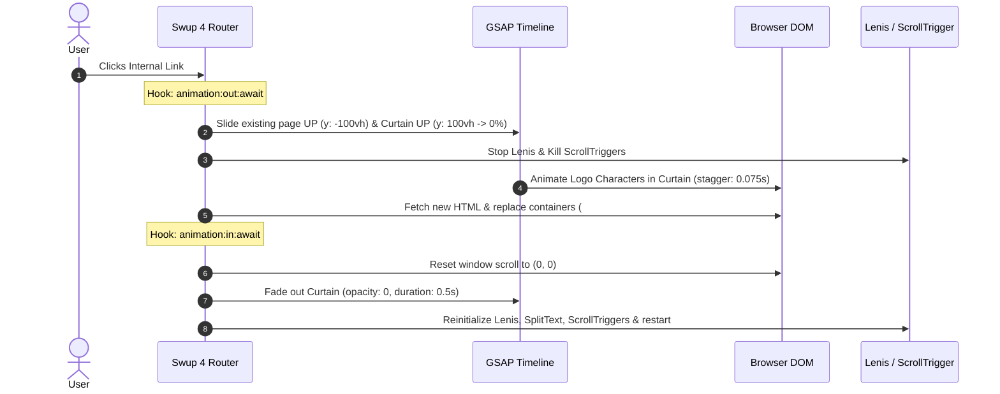
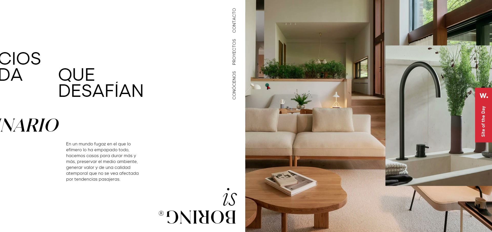
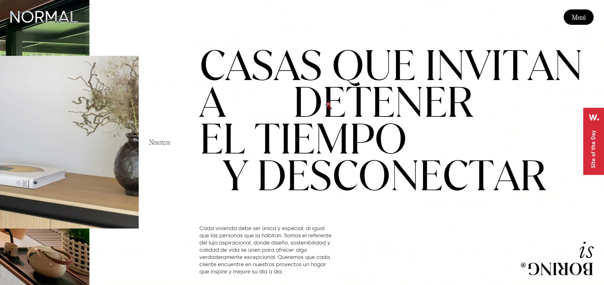
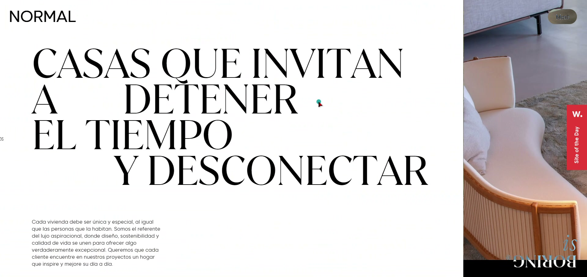
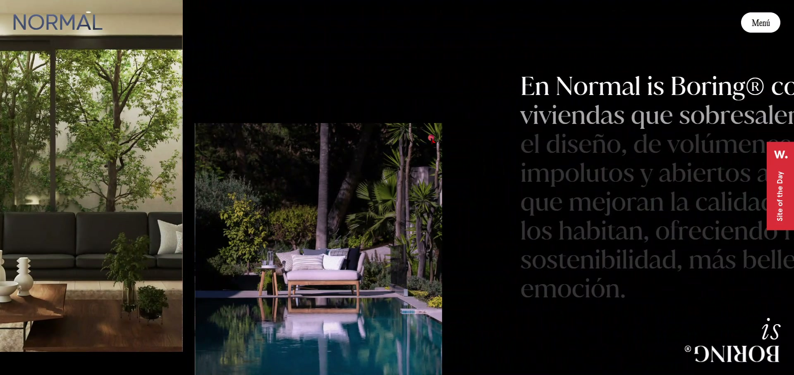
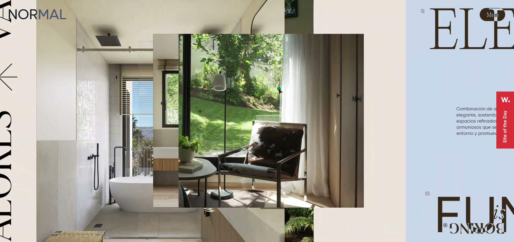
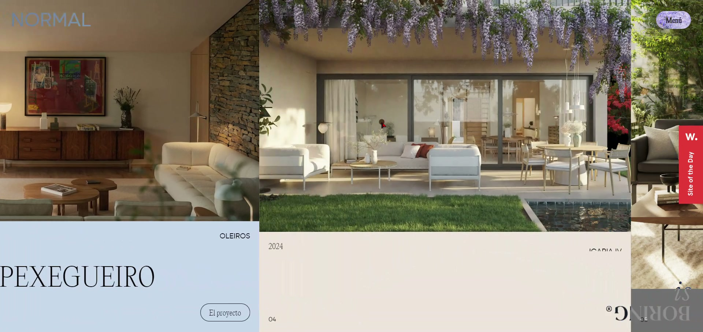
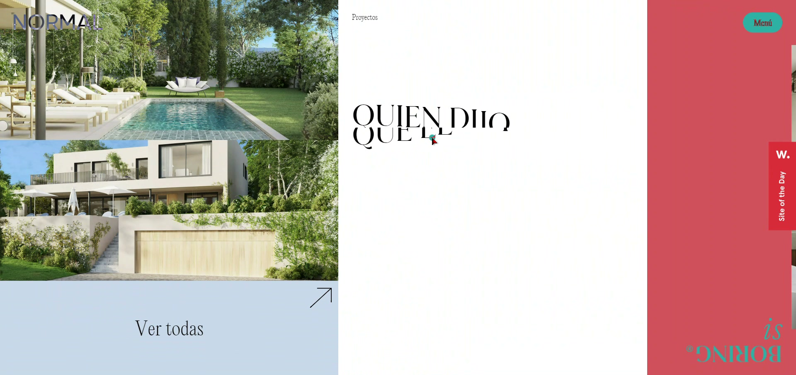
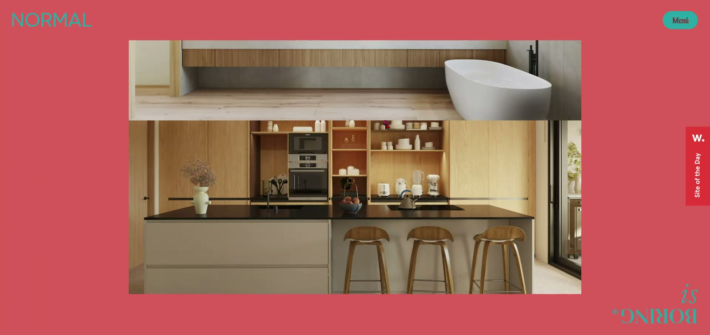
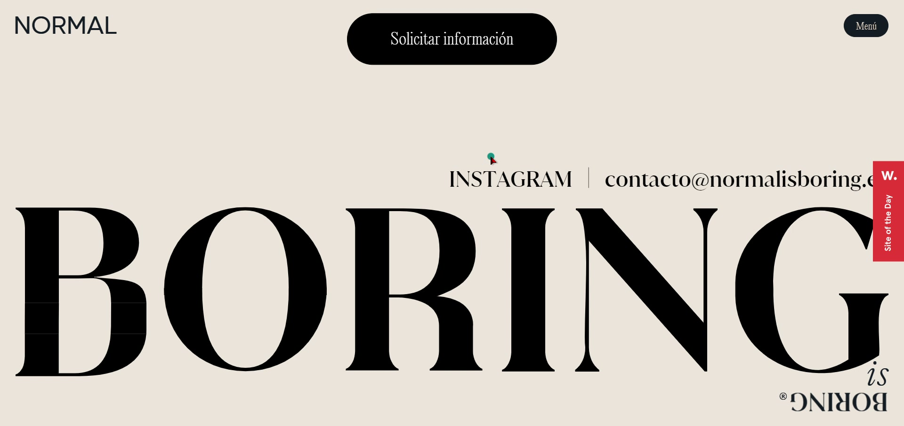

# 🎬 Normal is Boring (`normalisboring.es`) — Complete Engineering & Animation Breakdown

> **Website**: [normalisboring.es](https://normalisboring.es) — *Awwwards Site of the Day*  
> **Source Theme**: `normalisboring25` (WordPress + Custom Frontend)  
> **Investigation Basis**: 359 frames extracted at 14.5 FPS + Live Chrome DevTools Protocol inspection + 6 Frontend Source Files (`main.js`, `scroll.js`, `animations.js`, `rollovers.js`, `clicks.js`, `preloader.js`)

---

## 📑 Table of Contents
1. [Core Architectural Blueprint](#1-core-architectural-blueprint)
2. [Full Technology Stack & Package Ecosystem](#2-full-technology-stack--package-ecosystem)
3. [All 18 ScrollTrigger Instances (Live Telemetry)](#3-all-18-scrolltrigger-instances-live-telemetry)
4. [Deep-Dive: Swup 4 SPA Page Transitions](#4-deep-dive-swup-4-spa-page-transitions)
5. [Deep-Dive: Final Section & Footer Text Animations](#5-deep-dive-final-section--footer-text-animations)
6. [Interactive & Rollover Systems](#6-interactive--rollover-systems)
7. [Frame-by-Frame Visual & Effect Breakdown (359 Frames)](#7-frame-by-frame-visual--effect-breakdown-359-frames)
8. [Complete Production-Ready Recreation Boilerplate](#8-complete-production-ready-recreation-boilerplate)

---

## 1. Core Architectural Blueprint

The website appears to have multiple vertical sections, but under the hood, **the entire desktop experience is driven by a single, pinned horizontal scroll timeline**.

```
Native Mousewheel / Touch / Inertia Scroll (Lenis)
   │
   ▼
Master ScrollTrigger (Pins `main` for 7,441px of scroll distance)
   │
   ▼
Master GSAP Horizontal Timeline (`scroll_tl`)
   │
   ├── [01. Intro Section]      ──► SplitText line clip + Character stagger
   ├── [02. Principal Images]   ──► `flipMedia--upDown` (Top-to-bottom clip reveal)
   ├── [03. Text Kinetic Block] ──► Horizontal line-drift ("DETENER" shifts position)
   ├── [04. Dark Section]       ──► Per-line progressive opacity reveal (0.2 ➔ 1.0)
   ├── [05. Carousel Block]     ──► Vertical entrance (`y: '175vh' ➔ 0`) inside horizontal scroll
   ├── [06. Values ("Terms")]   ──► `follow__wrap` + Interactive hover image switcher
   ├── [07. Projects Section]   ──► Expanding project cards (`width: 15vw ➔ 60vw`)
   ├── [08. Final Project Card] ──► Alternating character slide-in (-110% vs +110%)
   └── [09. Closing Cierre]     ──► Full-bleed pink canvas + Image horizontal slide
```

### Key Discoveries:
1. **Single Pinned Master Timeline (`scroll_tl`)**: The entire width of `.mod-scroll` (7,441px) is translated along `x: -[width]` over 100% of the pin duration.
2. **Nested `containerAnimation` ScrollTriggers**: All sub-section animations, text reveals, and image clips use `containerAnimation: scroll_tl`, syncing their triggers to horizontal offset rather than vertical window scroll.
3. **Adaptive Color Phase Engine**: As each colored panel slides into the viewport, ScrollTrigger callbacks swap CSS custom variables for the header logo, navigation button, and fixed bottom watermark.

---

## 2. Full Technology Stack & Package Ecosystem

| Technology / Library | Version | Role in Architecture |
| :--- | :--- | :--- |
| **GSAP** | `3.12.7` | Core animation sequencer and property tween engine |
| **ScrollTrigger** | `3.12.7` | Scroll synchronization and container animation pinning |
| **GSAP SplitText** | *Club GreenSock* | Splitting headlines and paragraphs into 783 distinct `.char`, `.word`, `.line` nodes |
| **GSAP MorphSVGPlugin**| *Club GreenSock* | Vector path deformation on the giant footer "BORING" typography |
| **GSAP ScrollSmoother**| *Club GreenSock* | Mobile and fallback smooth scrolling controller |
| **Lenis** | `1.3.1` | Desktop inertia physics-based smooth scrolling |
| **Swup** | `4.x` | SPA router managing container swaps, transition curtains, and memory teardown |
| **Swiper** | `8.4.5` | Drag/swipe support for mobile project sliders |

---

## 3. All 18 ScrollTrigger Instances (Live Telemetry)

From DevTools runtime evaluation:

| # | Target Trigger Class | Pin | Scrub | Primary Animation |
|:---|:---|:---:|:---:|:---|
| **0** | `.mod-scroll__projects__item.bg-beige` | ❌ | ❌ | First project card expansion & title slide-up |
| **1** | `.mod-scroll__projects__item.last-item.bg-grey` | ❌ | ❌ | Final project card stacking & alternating char reveal |
| **2** | `.mod-scroll__cierre.bg-red` | ❌ | ❌ | Pink closing section entry trigger |
| **3** | `.mod-scroll__cierre__content` | ❌ | ❌ | Closing image horizontal translation |
| **4** | **`.mod-scroll`** | **✅** | **❌** | **MASTER PIN TRIGGER (Pins `main` over 7,441px)** |
| **5** | `.mod-scroll__images.bg-white.principal` | ❌ | ❌ | Initial hero interior image parallax |
| **6** | `.mod-scroll__intro.bg-white` | ❌ | ❌ | Intro section view tracker |
| **7** | `.mod-scroll__images__flip.flipMedia--upDown` | ❌ | ❌ | Top-to-bottom clip-path image transition |
| **8** | `.mod-scroll__images-text__flip.flipMedia--rightLeft` | ❌ | ❌ | Dark section right-to-left clip transition |
| **9** | `.mod-scroll__images-text__flip.flipMedia--leftRight` | ❌ | ❌ | Dark section left-to-right clip transition |
| **10** | `.mod-scroll__images__flip.flipMedia--rightLeft` | ❌ | ❌ | Secondary module clip transition |
| **11** | `.mod-scroll__images__flip.flipMedia--leftRight` | ❌ | ❌ | Secondary module clip transition |
| **12** | `.mod-scroll__cierre.bg-red` | ❌ | ❌ | Cierre image clip transition |
| **13** | `.mod-scroll__text.bg-white` | ❌ | **0** | Horizontal sliding line animation ("DETENER") |
| **14** | `.mod-scroll__images-text__text p` | ❌ | **0** | Line-by-line opacity reveal (`0.2 ➔ 1.0`) |
| **15** | `.mod-scroll__carousel.bg-beige` | ❌ | **0.5**| Vertical slide-up (`y: '175vh' ➔ 0`) |
| **16** | `.mod-scroll__terms.bg-blue` | ❌ | **1** | Values section parallax padding & text stagger |
| **17** | `.mod-scroll__projects__text` | ❌ | ❌ | Project manifesto paragraph mask reveal |

---

## 4. Deep-Dive: Swup 4 SPA Page Transitions

### Architectural Flow



### Exact Source Implementation (`main.js`)

```javascript
// 1. Swup Configuration
swup = new Swup({
    containers: ['#smooth-wrapper', '#wrap-modals'],
    linkSelector: 'a[href]:not([href="contacto"]):not([href="disponibilidad"]):not([target="_blank"])',
    animateHistoryBrowsing: true,
    cache: false
});

// 2. Exit Hook (animation:out:await)
swup.hooks.replace('animation:out:await', async () => {
    if (document.querySelector('.modal--alert')) alert_tl.timeScale(2).reverse();

    const anima_out = gsap.timeline({ paused: true });

    // Slide current view up
    anima_out.fromTo(header, { y: '0%' }, { y: '-100vh', duration: 1, ease: 'power3.inOut' });
    anima_out.fromTo(menu, { y: '0%' }, { y: '-100vh', duration: 1, ease: 'power3.inOut' }, '<');
    
    const scrollTarget = (document.querySelector('.mod-scroll') && onScroll) 
        ? document.querySelector('.mod-scroll') 
        : smoothWrapper;
    anima_out.fromTo(scrollTarget, { y: '0%' }, { y: '-100vh', duration: 1, ease: 'power3.inOut' }, '<');

    // Slide transition curtain up
    anima_out.fromTo(transition, { y: '100vh' }, {
        y: '0%', duration: 1, ease: 'power3.inOut',
        onComplete: () => {
            cleanLogo();
            gsap.set(header_logo, { opacity: 0 });
            header_btn_tl.progress(0).reverse();
            header_anchors_tl.progress(0).reverse();
            gsap.set(transition, { zIndex: 5 });
            gsap.set([header, menu, smoothWrapper], { y: '0%' });
            menu_tl.progress(0.000001).reverse();
            openMenu = false;
        }
    }, '<');

    // Stagger characters inside transition curtain
    anima_out.to(transition, {
        opacity: 1, duration: 2.65, ease: 'power3.inOut',
        onStart: () => {
            gsap.from(header.querySelectorAll('.logo__normal span, .logo__is span, .logo__boring span'), {
                x: '120%', duration: 0.33, stagger: 0.075, ease: 'power3.out',
                onStart: () => gsap.set(header_logo, { opacity: 1 })
            });
        }
    });

    await anima_out.play();
});

// 3. Enter Hook (animation:in:await)
swup.hooks.replace('animation:in:await', async () => {
    await setTimeout(() => {
        window.scrollTo(0, 0);
        smoothWrapper = document.querySelector("#smooth-wrapper");
        smoothContent = document.querySelector("#smooth-content");
        main = document.querySelector('main');
        chaptersAll = document.querySelectorAll('.mod-title--chapter.count');
        terms = document.querySelector('.mod-scroll__terms') || undefined;

        if (document.querySelector('.mod-scroll__intro.bg-black') || document.querySelector('.mod-header--proyecto')) {
            smoothWrapper.classList.add('bg-black');
        }

        gsap.killTweensOf(transition);
        gsap.to(transition, {
            opacity: 0, duration: 0.5, ease: 'linear',
            onComplete: () => {
                gsap.set(transition, { opacity: 1, y: '100%', zIndex: '' });
                setTimeout(init, 50);
            }
        });
    }, 100);
});
```

---

## 5. Deep-Dive: Final Section & Footer Text Animations

### A. Alternating Character Slide (`.last-item__content__title`)

```javascript
const lastProject_content_tl = gsap.timeline({ paused: true });

// Split title into chars & words
const splitTitle = SplitText.create('.last-item__content__title', { type: "chars, words", charsClass: 'char' });

// Split body into lines and wrap each in an overflow-hidden <span>
const splitText = SplitText.create('.last-item__content__text > p', { type: "lines", linesClass: 'line' });
splitText.lines.forEach(elem => {
    elem.innerHTML = `<span class="w-100">${elem.innerHTML}</span>`;
});

// Section label entrance
lastProject_content_tl.from('.last-item__content__section', { opacity: 0, y: '100%', duration: 0.33 });

// Alternating character entrance: Even lines from -110% (top), Odd lines from +110% (bottom)
document.querySelectorAll('.last-item__content__title .line').forEach((el, ind) => {
    const posInit = (ind % 2 !== 0) ? '-110%' : '110%';
    lastProject_content_tl.from(el.querySelectorAll('.char'), {
        y: posInit,
        duration: 0.65,
        stagger: 0.03,
        ease: 'power3.out'
    }, "<+=.2");
});

// Paragraph lines slide up
lastProject_content_tl.from(document.querySelectorAll('.last-item__content__text span'), {
    y: '100%', duration: 0.5, stagger: 0.09, ease: 'power3.easeOut'
}, "<+=.33");
```

---

### B. Kinetic Typographic Word Expansion (`.mod-scroll__projectInt__title`)

```javascript
const title = elem.querySelector('.mod-scroll__projectInt__title');
const year = elem.querySelector('.mod-scroll__projectInt__section');
year.classList.add('clip-y');
const splitYear = new SplitText(year, { type: "words", wordsClass: 'word' });

const projectInt_title_tl = gsap.timeline({ paused: true });

// Word expands margin, creating physical separation
projectInt_title_tl.to(title.querySelector('div:nth-of-type(1)'), {
    marginRight: 25, duration: 3, ease: 'power3.inOut'
});

// Year slides up from clip mask
projectInt_title_tl.from(year.querySelector('.word'), {
    y: '100%', duration: 1.25, ease: 'power2.out'
}, '<');

ScrollTrigger.create({
    containerAnimation: scroll_tl,
    animation: projectInt_title_tl,
    trigger: elem,
    start: "65% 100%",
    toggleActions: 'play none none reverse'
});
```

---

### C. Footer "BORING" Vector Path Morphing (`MorphSVGPlugin`)

```javascript
const footer_logo_tl = gsap.timeline({ paused: true });

// Deforms letter curves from compressed (_inicial) to expanded (_final) vector coordinates
footer_logo_tl.to("#B_inicial_top", { duration: 1, morphSVG: "#B_final_top" }, 0);
footer_logo_tl.to("#B_inicial_bottom", { duration: 1, morphSVG: "#B_final_bottom" }, 0);
footer_logo_tl.to("#B_inicial_left", { duration: 1, morphSVG: "#B_final_left" }, 0);
footer_logo_tl.to("#B_inicial_right", { duration: 1, morphSVG: "#B_final_right" }, 0);
footer_logo_tl.to("#O_inicial_top", { duration: 1, morphSVG: "#O_final_top" }, 0);
footer_logo_tl.to("#O_inicial_bottom", { duration: 1, morphSVG: "#O_final_bottom" }, 0);
footer_logo_tl.to("#R_inicial", { duration: 1, morphSVG: "#R_final" }, 0);

ScrollTrigger.create({
    animation: footer_logo_tl,
    trigger: '.mod-footer__bg',
    start: "top 50%",
    end: 'bottom bottom',
    scrub: 2
});
```

---

## 6. Interactive & Rollover Systems

### Character-Stagger Text Rollover (`rollovers.js`)

When hovering over any link on the page, the text splits and duplicates itself. Line 1 slides up and out while Line 2 slides up from below, with per-character staggered timing.

```javascript
const splitText = new SplitText(elem, { type: "chars,words,lines", linesClass: 'line', charsClass: 'char' });
const link_content = elem.innerHTML;
elem.innerHTML += link_content; // Clone content for the secondary line

gsap.set(elem.querySelectorAll('.line:nth-of-type(2) .char'), { y: '105%' });

elem.addEventListener('mouseenter', () => {
    gsap.to(elem.querySelectorAll('.line:nth-of-type(2) .char'), {
        y: '0%', duration: 0.5, ease: 'power2.inOut', stagger: 0.025
    });
    gsap.to(elem.querySelectorAll('.line:nth-of-type(1) .char'), {
        y: '-105%', duration: 0.5, delay: 0.025, ease: 'power2.inOut', stagger: 0.025
    });
});

elem.addEventListener('mouseleave', () => {
    gsap.killTweensOf(elem.querySelectorAll('.char'));
    gsap.to(elem.querySelectorAll('.line:nth-of-type(1) .char'), {
        y: '0%', duration: 0.5, ease: 'power2.inOut', stagger: 0.025
    });
    gsap.to(elem.querySelectorAll('.line:nth-of-type(2) .char'), {
        y: '105%', duration: 0.5, delay: 0.025, ease: 'power2.inOut', stagger: 0.025
    });
});
```

---

## 7. Frame-by-Frame Visual & Effect Breakdown (359 Frames)

````carousel

<!-- slide -->

<!-- slide -->

<!-- slide -->

<!-- slide -->

<!-- slide -->

<!-- slide -->

<!-- slide -->

<!-- slide -->

````

---

## 8. Complete Production-Ready Recreation Boilerplate

This clean, open-source boilerplate reproduces the core mechanics using **GSAP + ScrollTrigger + Lenis + SplitType + Swup 4**:

### `index.html`
```html
<!DOCTYPE html>
<html lang="en">
<head>
  <meta charset="UTF-8" />
  <meta name="viewport" content="width=device-width, initial-scale=1.0" />
  <title>Normal is Boring — Engine Recreation</title>
  <link rel="stylesheet" href="style.css" />
</head>
<body>
  <header class="header">
    <a href="/" class="logo">NORMAL</a>
    <button class="menu-btn"><span><span>Menú</span></span></button>
  </header>

  <div class="watermark">is BORING®</div>
  <div class="transition-curtain"><div class="curtain-logo">NORMAL IS BORING</div></div>

  <div id="smooth-wrapper">
    <main id="swup-container">
      <div class="mod-scroll">
        <!-- 01: Hero Intro -->
        <section class="panel bg-white intro-panel">
          <h1 class="hero-title">
            <span class="line">CASAS QUE DESAFÍAN</span>
            <span class="line">LO ORDINARIO</span>
          </h1>
        </section>

        <!-- 02: Kinetic Typography -->
        <section class="panel bg-white text-panel">
          <div class="kinetic-text">
            <div class="line">CASAS QUE INVITAN</div>
            <div class="line slide-line">A DETENER</div>
            <div class="line">EL TIEMPO</div>
            <div class="line">Y DESCONECTAR</div>
          </div>
        </section>

        <!-- 03: Dark Section -->
        <section class="panel bg-black dark-panel">
          <div class="progressive-text">
            <p>En Normal is Boring construimos viviendas que sobresalen por la calidad y el diseño, de volúmenes contemporáneos, impolutos y abiertos al exterior.</p>
          </div>
        </section>

        <!-- 04: Values Section -->
        <section class="panel bg-blue values-panel">
          <div class="value-item">
            <div class="val-num">01</div>
            <h2 class="val-title">ELEGANCIA</h2>
          </div>
        </section>

        <!-- 05: Final Alternating Title -->
        <section class="panel bg-beige final-panel">
          <h2 class="alternating-title">
            <span class="line">EXCLUSIVIDAD EN SU</span>
            <span class="line">MÁXIMA EXPRESIÓN</span>
          </h2>
        </section>
      </div>
    </main>
  </div>

  <script type="module" src="app.js"></script>
</body>
</html>
```

### `style.css`
```css
:root {
  --bg-white: #FFFFFF;
  --bg-black: #000000;
  --bg-beige: #ECE4DA;
  --bg-blue: #C7D7E9;
  --bg-red: #DB5C59;
}

body {
  margin: 0;
  background: var(--bg-white);
  font-family: 'Editorial New', serif, Georgia;
  overflow-x: hidden;
}

.header {
  position: fixed;
  top: 0; left: 0; width: 100%;
  padding: 2.5rem;
  display: flex;
  justify-content: space-between;
  z-index: 100;
  mix-blend-mode: difference;
  color: #fff;
}

.watermark {
  position: fixed;
  bottom: 2rem; right: 2rem;
  transform: rotate(180deg);
  font-size: 2rem;
  z-index: 100;
  mix-blend-mode: difference;
  color: #fff;
}

.transition-curtain {
  position: fixed;
  top: 0; left: 0; width: 100vw; height: 100vh;
  background: #000; color: #fff;
  transform: translateY(100vh);
  display: flex; align-items: center; justify-content: center;
  font-size: 3rem; z-index: 999;
}

.mod-scroll {
  display: flex;
  width: fit-content;
  height: 100vh;
}

.panel {
  width: 100vw;
  height: 100vh;
  flex-shrink: 0;
  padding: 8rem 6rem;
  box-sizing: border-box;
  display: flex;
  flex-direction: column;
  justify-content: center;
}

.bg-white { background: var(--bg-white); color: #000; }
.bg-black { background: var(--bg-black); color: #fff; }
.bg-beige { background: var(--bg-beige); color: #000; }
.bg-blue  { background: var(--bg-blue);  color: #1A1A1A; }
.bg-red   { background: var(--bg-red);   color: #000; }

.line { display: block; overflow: hidden; position: relative; }
.char { display: inline-block; will-change: transform; }

.hero-title, .alternating-title, .kinetic-text {
  font-size: 6.5vw;
  line-height: 0.95;
  text-transform: uppercase;
}

.progressive-text p {
  font-size: 2.5vw;
  line-height: 1.4;
  max-width: 60vw;
}
```

### `app.js`
```javascript
import gsap from 'gsap';
import { ScrollTrigger } from 'gsap/ScrollTrigger';
import Lenis from 'lenis';
import SplitType from 'split-type';
import Swup from 'swup';

gsap.registerPlugin(ScrollTrigger);

let lenis, scroll_tl;

function initEngine() {
  // 1. Initialize Lenis Smooth Scroll
  lenis = new Lenis({ duration: 1.2, easing: (t) => Math.min(1, 1.001 - Math.pow(2, -10 * t)) });
  lenis.on('scroll', ScrollTrigger.update);
  gsap.ticker.add((time) => lenis.raf(time * 1000));
  gsap.ticker.lagSmoothing(0);

  // 2. Master Horizontal Timeline
  const panels = gsap.utils.toArray('.panel');
  scroll_tl = gsap.timeline({ paused: true });
  scroll_tl.to(panels, {
    xPercent: -100 * (panels.length - 1),
    ease: "none"
  });

  // Master Pin Trigger
  ScrollTrigger.create({
    animation: scroll_tl,
    trigger: '.mod-scroll',
    pin: true,
    scrub: 1,
    end: () => `+=${document.querySelector('.mod-scroll').offsetWidth - window.innerWidth}`
  });

  // 3. Kinetic Sliding Line Animation
  const slideLine = document.querySelector('.slide-line');
  gsap.fromTo(slideLine, { x: '20vw' }, {
    x: '0vw',
    ease: 'power1.inOut',
    scrollTrigger: {
      containerAnimation: scroll_tl,
      trigger: '.text-panel',
      start: 'left 80%',
      end: 'left 20%',
      scrub: true
    }
  });

  // 4. Dark Section Progressive Text Opacity Reveal
  const splitProgressive = new SplitType('.progressive-text p', { types: 'lines' });
  gsap.fromTo(splitProgressive.lines, { opacity: 0.2 }, {
    opacity: 1,
    stagger: 0.1,
    scrollTrigger: {
      containerAnimation: scroll_tl,
      trigger: '.dark-panel',
      start: 'left 70%',
      end: 'left 20%',
      scrub: true
    }
  });

  // 5. Final Alternating Character Reveal
  const splitAlt = new SplitType('.alternating-title', { types: 'lines, chars' });
  document.querySelectorAll('.alternating-title .line').forEach((line, i) => {
    const fromY = i % 2 === 0 ? '110%' : '-110%';
    gsap.from(line.querySelectorAll('.char'), {
      y: fromY,
      duration: 0.7,
      stagger: 0.03,
      ease: 'power3.out',
      scrollTrigger: {
        containerAnimation: scroll_tl,
        trigger: '.final-panel',
        start: 'left 60%',
        toggleActions: 'play none none reverse'
      }
    });
  });
}

function initSwup() {
  const swup = new Swup({ containers: ['#swup-container'] });

  swup.hooks.replace('animation:out:await', async () => {
    const outTl = gsap.timeline();
    outTl.to('#swup-container', { y: '-100vh', duration: 0.9, ease: 'power3.inOut' }, 0);
    outTl.fromTo('.transition-curtain', { y: '100vh' }, { y: '0%', duration: 0.9, ease: 'power3.inOut' }, 0);
    await outTl.play();
  });

  swup.hooks.replace('animation:in:await', async () => {
    window.scrollTo(0, 0);
    gsap.set('#swup-container', { y: '0%' });
    ScrollTrigger.getAll().forEach(t => t.kill());
    await gsap.to('.transition-curtain', {
      opacity: 0, duration: 0.5,
      onComplete: () => gsap.set('.transition-curtain', { y: '100vh', opacity: 1 })
    });
    initEngine();
  });
}

document.addEventListener('DOMContentLoaded', () => {
  initEngine();
  initSwup();
});
```
